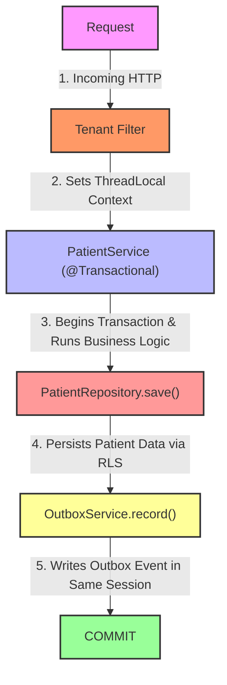

# Phase 02 — Transactional Outbox Persistence

## Goal

Implement the transactional persistence layer for the Outbox Pattern.

Guarantee that business writes and event registration occur inside the same database transaction.

---

## Implemented

* Created `outbox_events` table
* Added tenant isolation using PostgreSQL RLS
* Implemented `OutboxService`
* Added event metadata abstraction
* Persisted event payload as JSON
* Added integration tests validating patient creation + outbox event

---

## Flow



---

## Architectural Decisions

### Event payload is created in the application layer

Event construction remains simple and explicit.

No mapper or event converter abstraction was introduced.

Reason:
Keep focus on transactional consistency instead of event modeling.

---

### RLS remains enabled for outbox table

Outbox events are tenant scoped.

Tests that validate persisted state after request completion open a new tenant context because RLS depends on connection session state.

---

### Event payload does not mirror full entity state

Only relevant business information is persisted.

Example:

```json
{
  "patientId": "...",
  "name": "CLIENT NEW"
}
```

---

## Lessons Learned

* Database session state is connection scoped
* RLS works independently from application memory
* Transaction boundaries differ from request boundaries
* Event-driven consistency starts with persistence, not publishing
