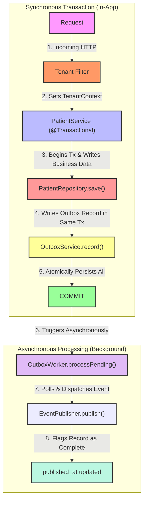

# Phase 03 — Outbox Event Processing Worker

## Goal

Implement asynchronous processing for pending outbox events.

This phase focuses on proving the second half of the Transactional Outbox Pattern:

Business transaction persistence → event publication → event completion.

---

## Implemented

* Added `EventPublisher` abstraction
* Implemented `LogEventPublisher`
* Created `OutboxWorker`
* Added `OutboxWorkerRepository`
* Introduced dedicated worker database access
* Implemented event publication flow
* Added integration test validating end-to-end processing

---

## Flow

---

## Architectural Decisions

### Worker reads events outside tenant session

The application uses PostgreSQL Row Level Security (RLS).

Because pending events must be processed across multiple tenants, the worker cannot depend on tenant-scoped application access.

A dedicated operational access path was introduced for event discovery.

---

### Worker uses dedicated JDBC access

Instead of introducing multiple Spring Data sources and transaction managers, the worker repository uses a dedicated `JdbcTemplate`.

Reason:

* Keep the lab focused on Outbox Pattern
* Avoid infrastructure complexity
* Keep processing explicit

---

### Event publication remains infrastructure agnostic

The publisher implementation currently logs events.

Reason:

The goal is validating the processing loop, not integrating external brokers.

Future implementations may replace the publisher with Kafka, SQS or EventBridge.

---

## Testing Strategy

Integration test validates:

* Patient creation
* Outbox persistence
* Pending event discovery
* Worker execution
* Event completion (`published_at`)
* Publication execution

---

## Lessons Learned

* Database session state is connection scoped
* RLS affects asynchronous processing
* Workers operate differently from request flows
* Infrastructure concerns should not dominate business flow
* Transactional Outbox starts simple before introducing messaging platforms
