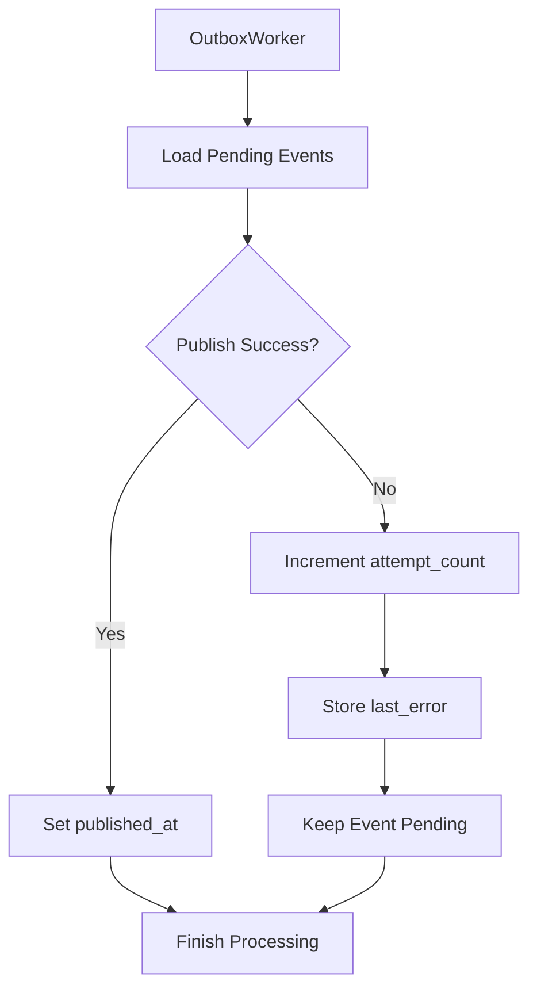

# Phase 04 — Outbox Failure Handling and Retry

## Goal

Extend the Transactional Outbox implementation to support failure handling and event retry.

This phase focuses on increasing delivery reliability by preserving failed events and allowing future reprocessing.

The objective is not guaranteeing delivery, but guaranteeing that failures become observable and recoverable.

---

## Implemented

* Added publication failure handling
* Added retry tracking
* Introduced `attempt_count`
* Introduced `last_error`
* Preserved failed events as pending
* Added worker recovery integration tests
* Improved testing utilities and event verification

---

## Flow

---

## Architectural Decisions

### Failed events remain visible

Events are not removed after failure.

Reason:

This enables future retries and operational inspection.

Current state fields:

* `published_at`
* `attempt_count`
* `last_error`

---

### Retry metadata remains inside Outbox

Instead of introducing additional tables or retry infrastructure.

Reason:

Keep the lab focused on reliability concepts.

---

### Worker remains infrastructure agnostic

Publication still occurs through `EventPublisher`.

Reason:

Retry behavior should not depend on the transport implementation.

Future publishers may target:

* Kafka
* SQS
* EventBridge

---

## Testing Strategy

Integration tests validate:

### Successful publication

* Create patient
* Generate outbox event
* Execute worker
* Verify publication
* Verify event completion

### Failure scenario

* Simulate publication exception
* Preserve pending event
* Increment retry counter
* Persist error information

---

## Lessons Learned

* Transaction success and event publication are independent concerns
* Retry metadata should survive publication failures
* Database session state affects worker execution
* RLS influences asynchronous processing
* Infrastructure failures should not corrupt business transactions

---

## Known Limitations

Current implementation intentionally does not include:

* Scheduled retries
* Backoff strategy
* Dead Letter Queue
* Event expiration
* Distributed workers
* Idempotency guarantees
