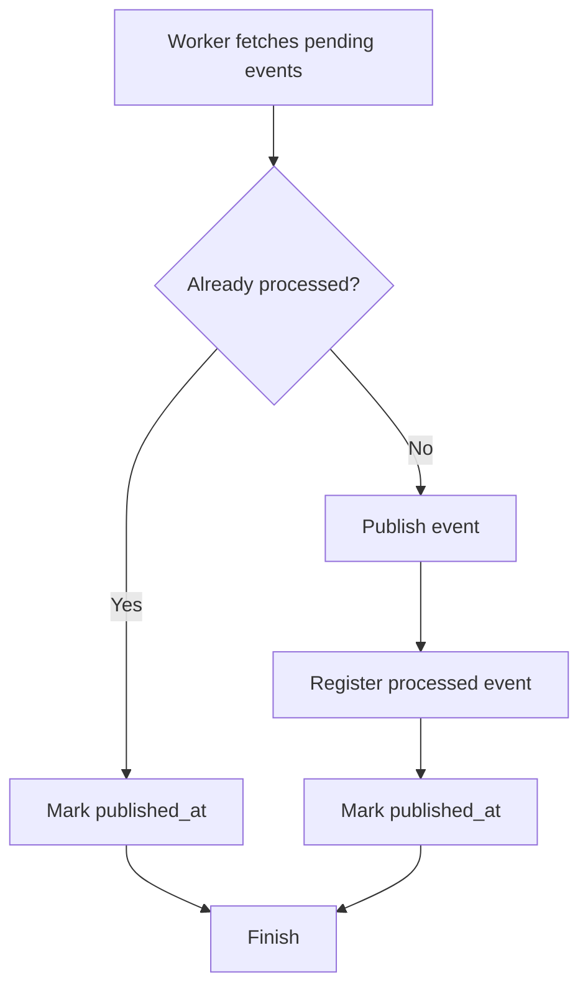

# Phase 06 — Idempotent Event Processing

## Goal

Prevent duplicate side effects during asynchronous event execution.

This phase introduces idempotent processing to the Transactional Outbox flow, ensuring events can be safely retried without generating duplicate publications.

The objective is to support at-least-once execution semantics while keeping business effects effectively once.

---

## Implemented

* Introduced `processed_events` persistence
* Added idempotency infrastructure layer
* Implemented processed event tracking
* Updated `OutboxWorker` to validate idempotency before publishing
* Added automatic completion for already processed events
* Prevented duplicate publication attempts
* Added integration coverage for processed and skipped scenarios
* Refactored integration tests into focused classes

---

## Flow

---

## Architectural Decisions

### Idempotency is independent from publication status

The system now distinguishes operational completion from business completion.

`processed_events` indicates the event already produced its intended effect.

`published_at` indicates the outbox record no longer requires processing.

This separation prevents duplicate execution while avoiding infinite pending loops.

---

### Worker remains retry-friendly

Failures still preserve pending state.

A future execution cycle may retry safely because previously completed events are detected before publication.

---

### Event processing remains infrastructure agnostic

The current publisher continues using a logging implementation.

The idempotency mechanism was designed independently from transport technology.

Future phases may replace the publisher with:

* RabbitMQ
* Kafka
* Amazon SQS
* Amazon EventBridge

without changing worker orchestration.

---

## Testing Strategy

Integration tests validate:

* Event publication
* Processed event registration
* Skip execution for already processed events
* Retry compatibility
* Published state completion

Tests were reorganized by responsibility:

* `PatientIntegrationTest`
* `OutboxWorkerIntegrationTest`

The refactor reduced coupling and improved readability.

Assertions were gradually migrated to AssertJ to encourage fluent and behavior-oriented validation.

---

## Lessons Learned

* At-least-once delivery requires idempotency
* Technical completion differs from business completion
* Retrying should be safe by design
* State transitions matter more than individual method calls
* Integration tests are useful for architectural validation
* Fluent assertions improve readability and reduce assertion mistakes

---

## Notes

This lab intentionally uses a higher proportion of integration tests than a typical production application.

The goal is educational:

validate architectural behavior end-to-end and make infrastructure interactions explicit.

Production systems would typically combine:

* Unit Tests
* Component Tests
* Integration Tests
* Contract Tests

with fewer full-stack execution scenarios.
