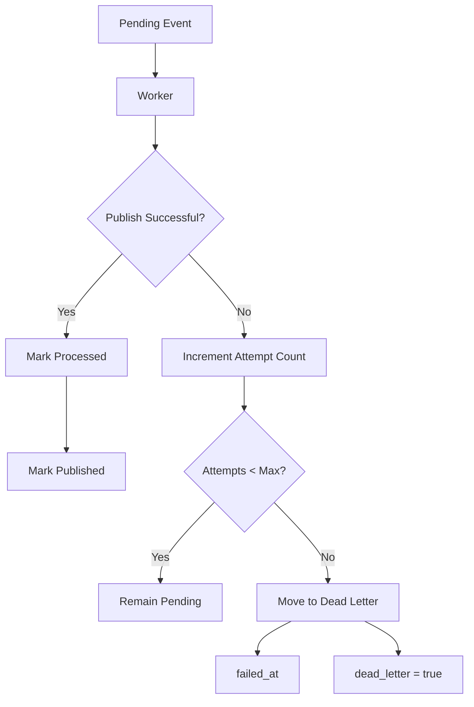

# Phase 07 — Dead Letter Queue (DLQ)

## Goal

Prevent events that repeatedly fail from being retried indefinitely.

This phase introduces a Dead Letter Queue (DLQ) strategy, allowing the worker to stop retrying permanently failing events while preserving diagnostic information for later analysis.

The processing pipeline now supports:

* Successful publication
* Retryable failures
* Idempotent execution
* Permanent failure isolation

---

## Implemented

* Added configurable retry limit (`worker.outbox.max-attempts`)
* Introduced Dead Letter state for outbox events
* Added failure timestamp (`failed_at`)
* Added dead letter flag (`dead_letter`)
* Updated worker retry logic to stop processing events after reaching the configured retry limit
* Updated pending event query to ignore dead letter events
* Replaced manual JDBC mapping with `BeanPropertyRowMapper`
* Added integration tests covering retry lifecycle and Dead Letter behavior

---

## Flow



---

## Architectural Decisions

### Retry limit is configuration-driven

The maximum number of retries is configured externally instead of being hardcoded.

This allows operational tuning without code changes and mirrors production messaging platforms that expose retry policies through configuration.

---

### Dead Letter represents a terminal state

Once an event reaches the configured retry limit, it is no longer considered eligible for processing.

The worker excludes dead letter events from future polling cycles.

---

### Failure tracking remains explicit

The worker records:

* Number of attempts
* Last error message
* Failure timestamp
* Dead Letter state

These fields provide operational visibility without requiring an external messaging system.

---

### Simplified JDBC mapping

The previous manual `RowMapper` implementation became harder to maintain as new columns were introduced.

The repository now uses `BeanPropertyRowMapper`, customizing only the JSON payload conversion.

Benefits:

* Less boilerplate
* Automatic mapping of new entity fields
* Reduced maintenance cost
* Lower risk of mapping inconsistencies

---

## Testing Strategy

Existing regression tests continue validating:

* Successful publication
* Retry behavior
* Scheduler execution
* Idempotent processing

New integration tests validate:

* Events remain pending before reaching the retry limit
* Events move to Dead Letter after the configured number of attempts
* Dead Letter events are ignored in subsequent worker executions

During implementation, retry execution was intentionally simulated by invoking the worker multiple times to emulate independent scheduler cycles.

---

## Lessons Learned

* Retry policies should be configuration-driven.
* Dead Letter Queue is a terminal operational state.
* Infrastructure code benefits from reducing manual mapping.
* `BeanPropertyRowMapper` automatically maps entity properties while allowing selective customization.
* TDD helped define the worker state transitions before implementation.
* Integration tests can describe architectural behavior, not only validate implementation.

---

## Result

The Outbox processing pipeline now supports a complete reliability lifecycle:

```text
Pending
    │
    ├── Published
    │
    ├── Retrying
    │
    └── Dead Letter
```

Future phases will replace the current logging publisher with an external message broker while preserving the reliability guarantees established throughout this lab.
