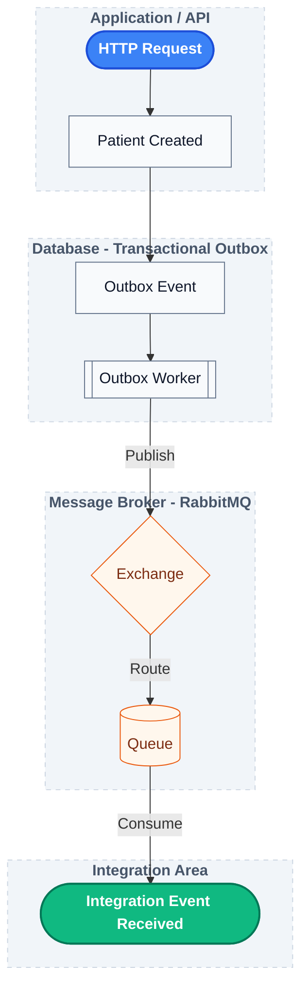

# Phase 08 — RabbitMQ Integration

## Objective

This phase connects the Transactional Outbox implementation to a real message broker.

Until the previous phase, events were considered "published" through an in-memory implementation that only logged the payload. The objective now is to publish integration events to RabbitMQ while preserving the reliability guarantees already built by the Outbox Pattern.

---

## What was implemented

### RabbitMQ infrastructure

A complete RabbitMQ environment was added for both local development and automated integration tests.

Development environment:

* RabbitMQ with Management UI
* Docker Compose support

Test environment:

* Testcontainers RabbitMQ
* Automatic broker lifecycle
* Full end-to-end integration tests

---

### Rabbit Event Publisher

The temporary logging publisher was replaced by a RabbitMQ implementation.

Responsibilities:

* Build the integration message
* Publish to the configured Exchange
* Use the event routing key

The existing `EventPublisher` abstraction remained unchanged, allowing the infrastructure implementation to evolve without impacting the Outbox Worker.

---

### Integration Event Contract

A dedicated integration contract was introduced.

Instead of exposing the persistence model (`OutboxEvent`) directly, the application now publishes an `EventEnvelope` containing:

* Event metadata
* Business payload

This separates persistence concerns from the message contract exposed to external systems.

Example structure:

```text
EventEnvelope
├── metadata
└── payload
```

---

### Event Mapping

An `EventEnvelopeMapper` was introduced to transform the persistence model into the integration model.

```text
OutboxEvent
        │
        ▼
EventEnvelopeMapper
        │
        ▼
EventEnvelope
```

This keeps responsibilities well separated:

* `OutboxEvent` → persistence
* `EventEnvelope` → integration contract
* `RabbitEventPublisher` → message publication

---

### RabbitMQ Topology

The application now declares its own messaging topology.

Configured resources:

* Topic Exchange
* Durable Queue
* Binding using routing pattern

Example:

```text
Exchange

asclepio.events

        │

Routing Key

patient.created

        │

Binding

patient.#

        │

Queue

patient.events.queue
```

The topology is created automatically when the application starts.

---

### Message Serialization

Spring AMQP uses `SimpleMessageConverter` by default, which only supports basic payload types.

To publish custom Java objects, a `Jackson2JsonMessageConverter` was configured, allowing integration events to be automatically serialized as JSON before being sent to RabbitMQ.

---

## Integration Testing

The testing strategy evolved together with the architecture.

Previous phases validated publication through console output.

Intermediate implementation validated interaction with `RabbitTemplate` using Mockito.

This phase validates the real architectural behavior by asserting that the message is successfully delivered to RabbitMQ.

Current flow:



The tests now verify:

* Event publication
* Exchange routing
* Queue delivery
* JSON serialization
* Message deserialization
* Metadata preservation
* Payload integrity

This approach validates the observable behavior of the system rather than implementation details.

---

## Design Decisions

### Persistence Model vs Integration Model

The project intentionally distinguishes two different models.

Persistence:

```text
OutboxEvent
```

Integration:

```text
EventEnvelope
```

This prevents internal processing information (retry counters, publication timestamps, dead-letter state, etc.) from leaking into externally published messages.

---

### Routing Keys

Routing keys are derived from the event type.

Example:

```text
PATIENT_CREATED

↓

patient.created
```

This enables flexible topic-based routing while keeping event definitions simple.

---

## Key Learnings

* RabbitMQ producers publish to Exchanges rather than directly to Queues.
* Topic Exchanges allow routing using wildcard patterns such as `patient.#`.
* Integration contracts should remain independent of persistence models.
* Spring AMQP requires a JSON message converter to serialize custom Java objects.
* Declaring Exchange, Queue and Binding through Spring configuration keeps infrastructure reproducible across environments.
* Integration tests become more valuable when validating externally observable behavior instead of internal implementation details.
* As distributed systems evolve, tests naturally shift from verifying method calls to validating communication between independent components.
